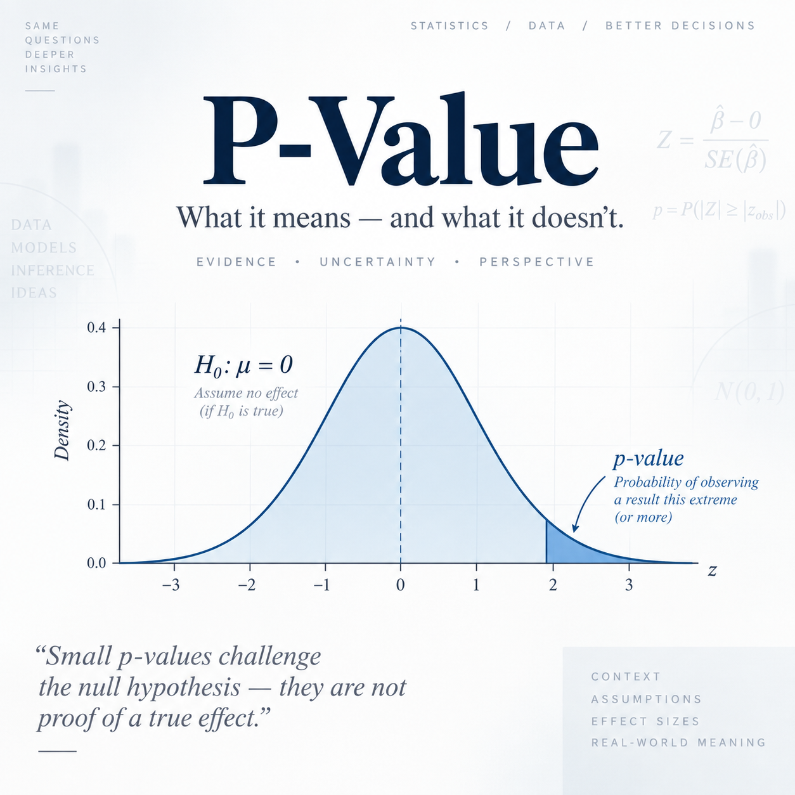

{width="500px"}

# Why Is the p-value So Easy to Misunderstand?

In statistics, the p-value is probably one of the most commonly used—and most commonly misunderstood—concepts. When people first learn about hypothesis testing, it is natural to interpret a p-value as “the probability that the null hypothesis is true.” For example, if a test gives \(p=0.03\), someone might think, “There is only a 3% chance that the null hypothesis is true.” However, that is not what a p-value means.

This blog asks a simple question: **What does a p-value actually measure, and why is its true meaning so different from what our intuition suggests?**

Suppose we want to test whether a coin is fair. Our null hypothesis is:

$$
H_0:p=0.5
$$

In other words, we temporarily assume that the coin is fair. Now suppose we flip the coin 100 times and observe 60 heads.

Our intuition might lead us to ask: “After seeing this result, what is the probability that the coin is still fair?” However, a traditional p-value does not answer that question. Instead, it asks:

> **If the coin really is fair, how unusual would it be to observe a result as extreme as 60 heads, or even more extreme?**

A p-value can therefore be written as:

$$
p\text{-value}
=
P(\text{observing the current result or a more extreme result}\mid H_0)
$$

The most important part is the direction of the conditional probability. A p-value calculates:

$$
P(\text{Data}\mid H_0)
$$

But what many people actually want to know is:

$$
P(H_0\mid \text{Data})
$$

These two probabilities may look very similar, but they are completely different. For example, “the probability that someone has the flu given that they have a fever” is not the same as “the probability that someone has a fever given that they have the flu.”

We can illustrate this idea using a simple Python simulation. If we assume that the coin is truly fair, we can repeatedly simulate experiments in which the coin is flipped 100 times and then examine how often we observe 60 or more heads, or an equally extreme result in the opposite direction:

```python
import numpy as np

np.random.seed(123)

simulations = np.random.binomial(
    n=100,
    p=0.5,
    size=100000
)

p_value = np.mean(
    (simulations >= 60) |
    (simulations <= 40)
)

print(p_value)
```

The simulated p-value is approximately **0.057**. This means that if the coin is actually fair, about 5.7% of repeated experiments would produce a result at least as extreme as the one we observed.

This does **not** mean that there is only a 5.7% chance that the coin is fair. It only tells us that **the observed data are somewhat unusual under the assumption that the coin is fair.**

This is what makes the p-value so counterintuitive. In real life, we usually observe the data first and naturally want to ask, “Given these data, how believable is my hypothesis?” Traditional hypothesis testing works in the opposite direction: it asks us to assume that \(H_0\) is true and then judge how unusual the observed data would be under that assumption.

This also explains why \(p<0.05\) is so often misinterpreted. It does not mean that “we are 95% certain that the research conclusion is correct,” nor does it mean that “there is only a 5% chance that the result occurred by accident.” It means only that **if the null hypothesis were true, the probability of observing the current result or something more extreme would be less than 5%.**

A small p-value can therefore be understood as the data sending us a warning: “If the null hypothesis is really true, this result looks a little strange.” But deciding how strongly we should doubt the null hypothesis also requires us to consider sample size, effect size, research design, and other evidence. We should not rely on the 0.05 threshold alone.

## Takeaway

**A p-value is not “the probability that the null hypothesis is true.” It is “the probability of observing the current result, or a more extreme one, assuming that the null hypothesis is true.”**

The key to understanding the p-value is not memorizing the number \(0.05\), but remembering the direction of the conditional probability:

$$
P(\text{Data}\mid H_0)
\neq
P(H_0\mid \text{Data})
$$

Once this distinction is clear, the p-value becomes much less mysterious.

---
