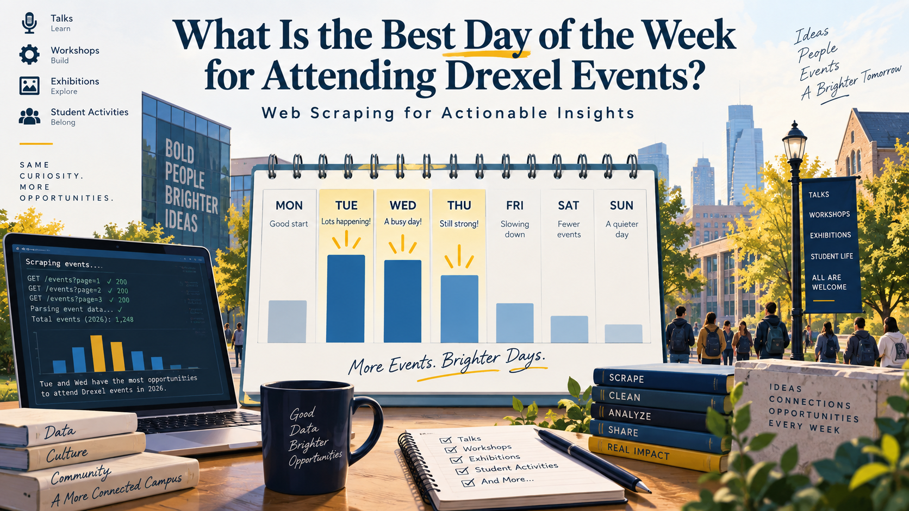

{width="500px"}

## When Should You Keep Your Schedule Open?

University event calendars can be overwhelming. Talks, workshops, exhibitions, career events, and student activities are spread across the week, but they are not necessarily distributed evenly. If someone wants to attend more campus events, does it matter which days they keep relatively flexible?

To answer this question, I analyzed events listed on the **Drexel University Events Calendar** for 2026. My research question is:

**Which day or days of the week offer the most opportunities among events currently listed on the Drexel University Events Calendar for 2026?**

The goal is not simply to count events. I want to turn publicly available calendar data into a practical scheduling recommendation.

## Scraping and Cleaning the Calendar

I collected the data from the [Drexel University Events Calendar](https://calendar.drexel.edu/EventList.aspx) using R and the `rvest` package. Before scraping, I checked the site's robots rules and confirmed that the calendar page was not disallowed. To limit the burden on the website, I requested only one monthly calendar page at a time and added a two-second pause between requests.

The scraping script collected event titles, dates, event IDs, and URLs for January through December 2026. It produced **3,869 raw calendar records**.

The raw data required cleaning. Events explicitly marked as cancelled were removed. This eliminated 292 calendar records representing four unique cancelled events. I also checked for exact duplicates based on event ID, information ID, and date, but found none.

```{r}
library(tidyverse)
library(here)

weekday_summary <- read_csv(
  here(
    "blog",
    "posts",
    "post2",
    "data",
    "processed",
    "weekday_summary.csv"
  ),
  show_col_types = FALSE
)

weekday_summary
```

One important choice was how to handle multi-day and recurring events. I treated an event appearing on multiple dates as multiple **attendance opportunities** because a person could potentially attend it on different days. However, I also performed a robustness check excluding events explicitly labeled as multi-day events.

## Tuesdays and Wednesdays Stand Out

The cleaned dataset contains **3,577 event occurrences**. Tuesdays had 707 listed opportunities and Wednesdays had 701. Because weekdays do not all occur exactly the same number of times in a calendar year, I divided the number of events by the number of occurrences of each weekday in 2026.

```{r}
weekday_summary |>
  ggplot(
    aes(
      x = reorder(weekday, events_per_weekday),
      y = events_per_weekday
    )
  ) +
  geom_col() +
  coord_flip() +
  labs(
    title = "Drexel Events Are Concentrated in the Middle of the Week",
    subtitle = "Currently listed event opportunities for 2026",
    x = NULL,
    y = "Average listed events per weekday"
  ) +
  theme_minimal()
```

A typical Tuesday had about **13.6 listed event opportunities**, compared with **13.5 on Wednesday** and **12.4 on Thursday**. The numbers fall substantially toward the weekend: Saturday averaged about 6.4 and Sunday only 4.9.

The difference between Tuesday and Wednesday is extremely small, so it would be misleading to claim that Tuesday is decisively the single best day.

## Does the Result Hold Up?

There are two important concerns. First, the data were scraped on September 21, 2026, so events later in the year may not yet be fully posted. Second, long-running events could disproportionately affect weekday counts.

I therefore repeated the analysis using only events occurring on or before September 21. In that sample, **Wednesday ranked slightly above Tuesday**. I also excluded events explicitly labeled as multi-day events; in that version, **Tuesday ranked first and Wednesday second**.

Across all three specifications, the broader pattern remained the same: **Tuesday and Wednesday consistently had the highest concentration of event opportunities, with Thursday close behind.**

## Takeaway

For someone trying to maximize opportunities to attend events listed on Drexel's calendar, the most useful scheduling strategy is not to focus on one single “best” day. Instead, **keeping Tuesdays and Wednesdays relatively flexible provides the greatest access to events, while Thursdays are another strong option**.

The analysis also illustrates an important lesson from web scraping: collecting the data is only the first step. Cleaning repeated listings, defining what counts as an opportunity, and recognizing incomplete future schedules are necessary before scraped data can support a useful real-world decision.