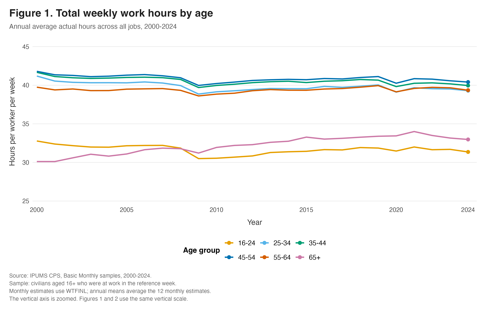
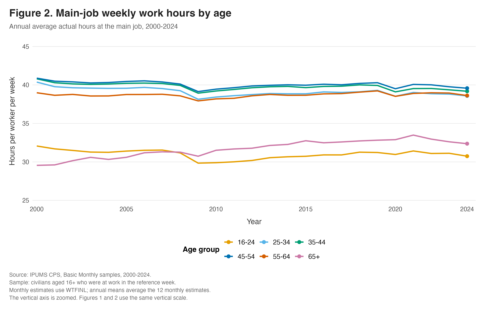
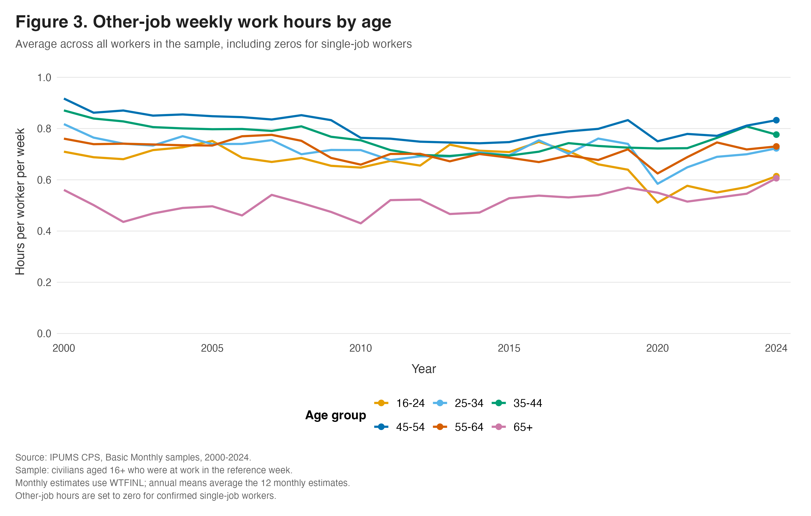
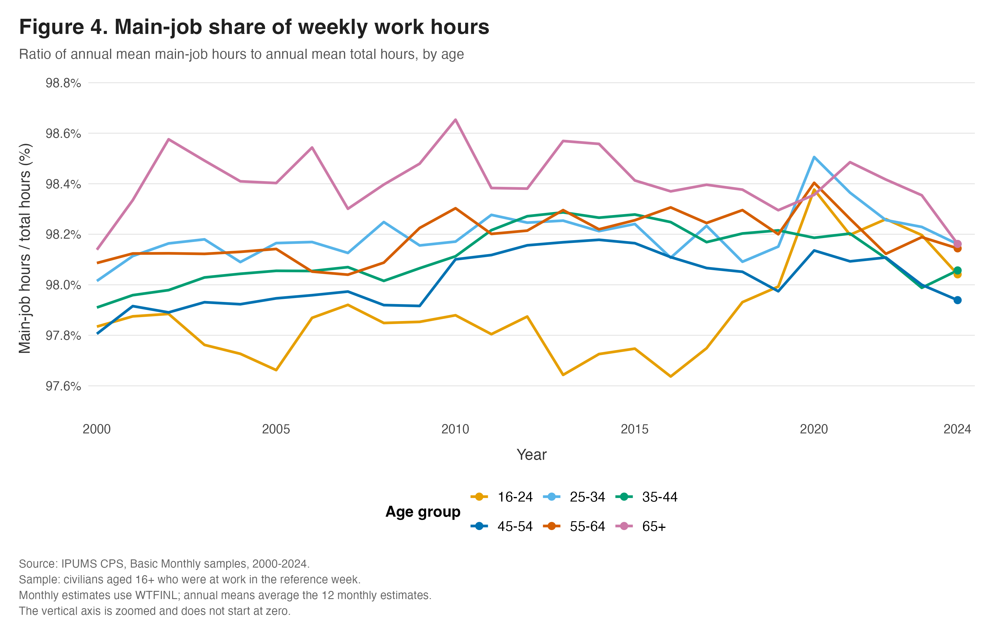
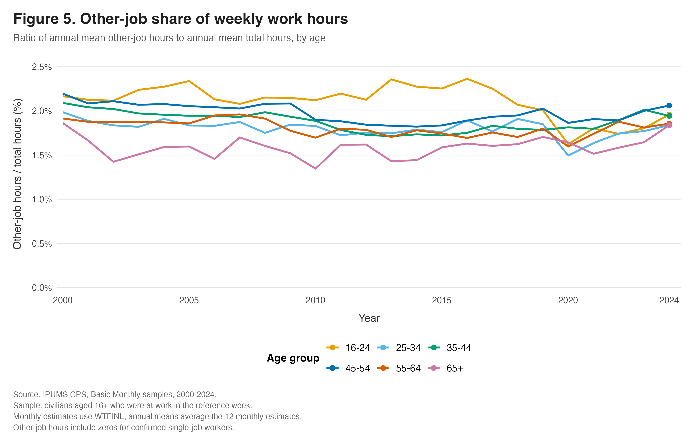

{width="500px"}

## Introduction
Employment tells us whether people work, but working hours reveal
another dimension of labor supply: how much time workers spend on
the job. Similar employment levels can coexist with different
working schedules. Separating main-job hours from hours at other
jobs also helps identify where changes in working time occur.

This post asks:
**How did actual weekly working hours change across age groups
in the United States between 2000 and 2024, and how much of the
pattern appears in main jobs versus other jobs?**

## Data and methods

I use microdata from [IPUMS CPS](https://cps.ipums.org/cps/),
covering all 300 Basic Monthly samples from January 2000 through
December 2024. The analysis includes civilians aged 16 or older
who were at work during the survey reference week (`EMPSTAT = 10`),
had positive sampling weights, and had valid hours information.

Workers are divided into six age groups:
16–24, 25–34, 35–44, 45–54, 55–64, and 65+.

The three hours variables measure actual hours during the
previous week:
[`AHRSWORKT`](https://cps.ipums.org/cps-action/variables/AHRSWORKT)
covers all jobs,
[`AHRSWORK1`](https://cps.ipums.org/cps-action/variables/AHRSWORK1)
covers the main job, and
[`AHRSWORK2`](https://cps.ipums.org/cps-action/variables/AHRSWORK2)
covers other jobs.
These measure actual working time rather than usual schedules.

All five figures use the same analysis sample.
Not-in-universe codes are excluded from hours calculations,
except that other-job hours are assigned zero for confirmed
single-job workers. Published topcoded values are retained.

Within each month and age group, I calculate weighted means using
[`WTFINL`](https://cps.ipums.org/cps-action/variables/WTFINL),
the person-level weight recommended for Basic Monthly analyses.
Thus, the estimates describe the population represented by the
retained observations rather than an unweighted average of survey
respondents. Annual hours are the average of the twelve monthly
weighted means.

## Figure 1: Total hours

{
  fig-alt="Figure 1. Annual average total weekly work hours by age, 2000–2024. Hours increase overall for workers aged 65 and older."
  width="100%"
}

Figure 1 shows substantial differences in working time across ages.
Workers aged 25–64 generally work longer weeks than the youngest
and oldest groups. However, the long-run changes differ:
most groups below age 65 end the period with lower average hours
than in 2000, while the 65+ group moves upward.

Among workers aged 65+, average weekly hours rise from approximately
30 to 33. For those aged 16–24, hours fall from approximately
33 to 31. The older group overtakes the youngest group during
the period.

These are changes among people who were working;
they do not establish whether older adults became more likely
to work.

## Figure 2: Main-job hours

{
  fig-alt="Figure 2. Main-job weekly work hours by age, 2000–2024. Patterns resemble total hours, using the same vertical scale as Figure 1."
  width="100%"
}

Figure 2 closely resembles Figure 1.
The upward movement among older workers and the lower endpoint
levels among younger and middle-aged groups also appear in
main-job hours. Using the same vertical scale in both figures
makes this comparison straightforward.

This similarity indicates that changes in main-job hours account
for much of the overall pattern. Understanding the changing
workweek therefore requires attention to hours in workers’
primary jobs.

## Figure 3: Other-job hours

{
  fig-alt="Figure 3. Other-job weekly work hours by age, 2000–2024. Averages include zero hours for confirmed single-job workers."
  width="100%"
}

Other-job hours contribute much less to the average workweek.
In 2024, the age-group averages are roughly 0.6–0.8 hours per worker
per week. Several groups show a decline around 2020 followed by
a recovery.

The denominator is essential:
these averages include single-job workers with zero other-job hours.
They do **not** imply that people holding multiple jobs spend less
than an hour working outside their main job.

The average combines how common multiple-job holding is with
how many other-job hours those workers report.

## Figure 4: Main-job share

{
  fig-alt="Figure 4. Main-job share of total hours by age, 2000–2024. Shares remain around 98 percent; the vertical axis is zoomed."
  width="100%"
}

Figure 4 expresses main-job hours relative to total hours.
Each annual share equals annual mean main-job hours divided by
annual mean total hours, multiplied by 100.
It is a ratio of means, not an average of individual workers’
percentages.

Main jobs consistently account for approximately 98% of measured
hours. Although the lines appear variable, the vertical axis is
narrowly zoomed: most movements represent fractions of a
percentage point.

The central finding is the persistent dominance of main-job hours.

## Figure 5: Other-job share

{
  fig-alt="Figure 5. Other-job share of total hours by age, 2000–2024. Shares generally remain around 1–2.5 percent."
  width="100%"
}

Figure 5 shows the complementary perspective.
Other jobs generally account for around 1–2.5% of hours.
Younger workers often have a relatively high other-job share
despite working fewer other-job hours than some middle-aged groups.

Their lower total hours help explain this distinction between
absolute hours and proportional importance.

Figures 4 and 5 describe essentially the same composition from
opposite directions. They should be interpreted together,
rather than treated as independent evidence.

## Interpretation and limitations

These patterns remain descriptive.
Changes can reflect shifts in occupations, part-time work,
or the composition of people who remain employed.

The figures do not follow a fixed cohort as it ages,
establish causal explanations, or demonstrate statistical
significance.

## Takeaway

**The takeaway is that the American workweek changed differently
across age groups.**

Older workers who were at work averaged longer weeks by 2024,
while most younger groups averaged shorter weeks than in 2000.
Main-job hours explain much of this pattern;
other jobs contribute a small, varying share of total working time.

## Reproducibility

The analysis code is available in the
[GitHub repository](https://github.com/RodgersYe/RodgersYe-Website).

To reproduce the figures, open the website’s RStudio project
and place the corresponding IPUMS extract at
`blog/posts/post3/data/raw/cps_raw.csv`.

Run `blog/posts/post3/code/01_clean_analyze.R`,
followed by `blog/posts/post3/code/02_make_figures.R`.

The scripts generate the processed estimates and figures using
project-relative paths.