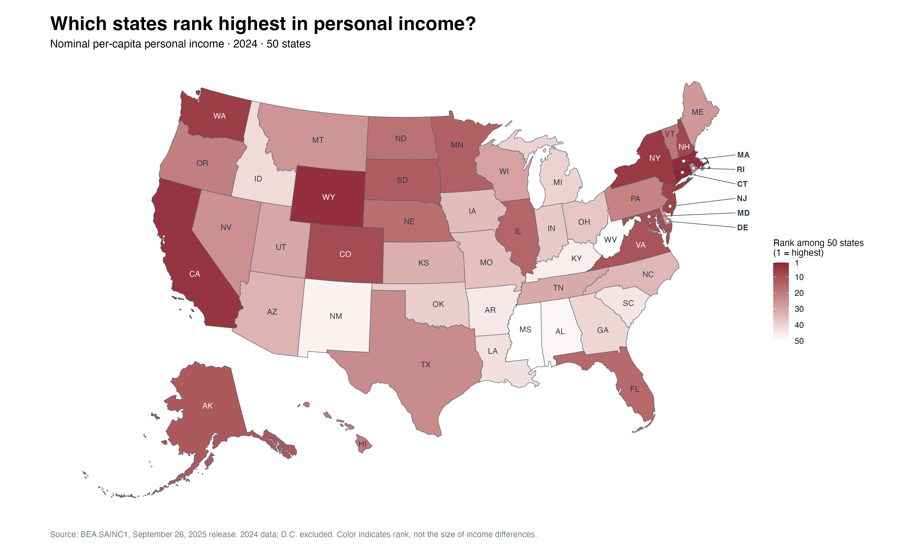
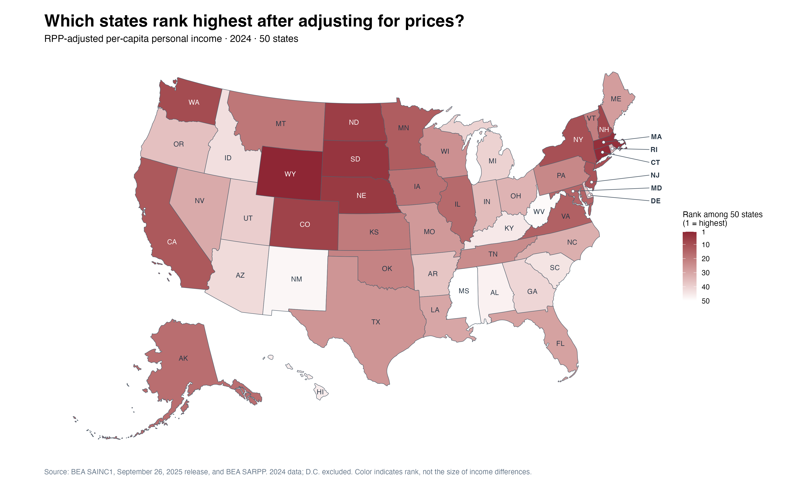
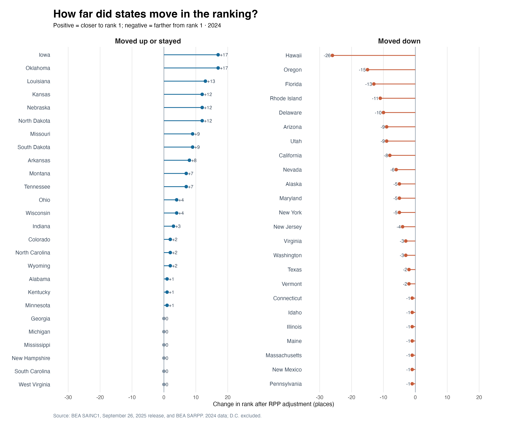
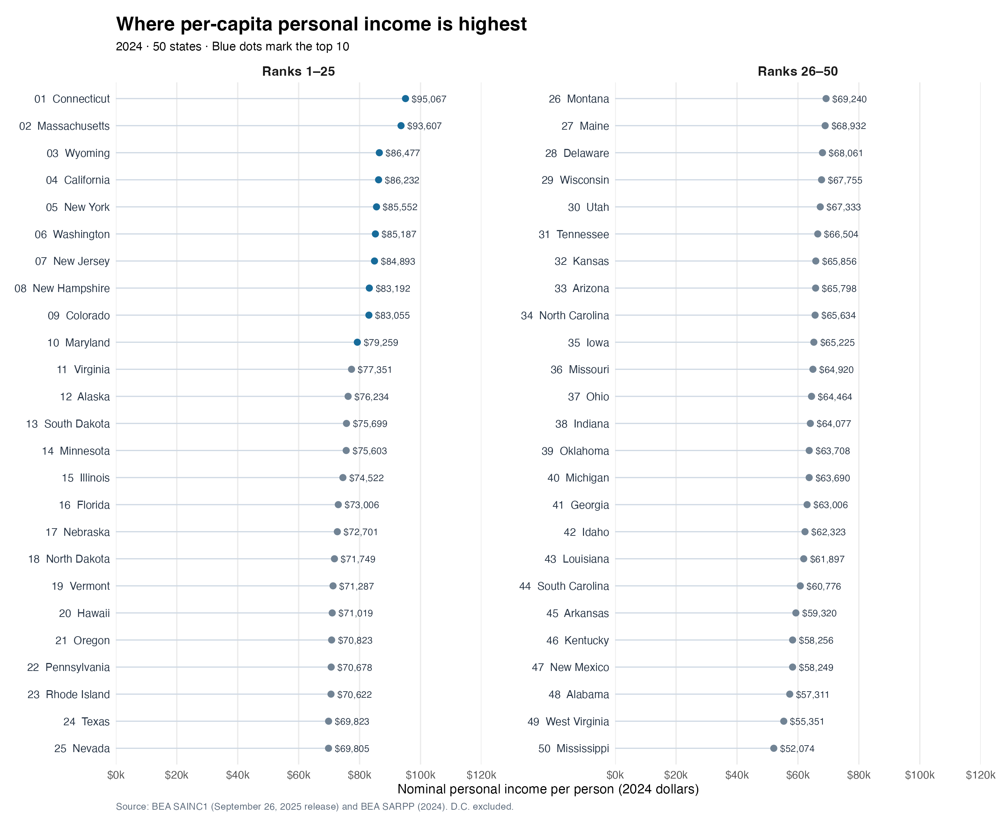
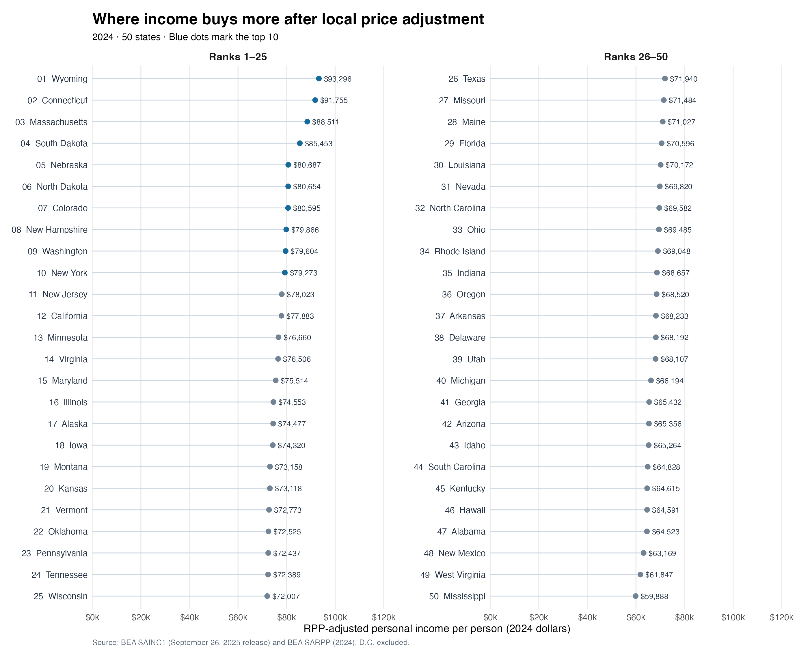

{width="500px"}

Lately, as I search for work, I have noticed that I remember the salary in a 
job posting before I remember its location. Pay is clear; local costs take 
digging. If two jobs each offered $80,000, I might mark them as tied on a 
spreadsheet. But what would that tie mean if rent, groceries, and 
transportation cost more near one job? I wanted a better starting point than 
"that place seems expensive" for thinking about what an income figure can 
actually buy.

A job posting cannot answer that question for an entire state, and a state 
average cannot choose a job for me. Still, my search led me to a broader 
question: **Do the states with the highest incomes stay at the top once local 
prices are taken into account?** To investigate, I use the Bureau of Economic 
Analysis's (BEA) [2024 per capita personal income](https://www.bea.gov/data/income-saving/personal-income-by-state) for 
the 50 states. It includes income beyond wages, so it is not a job seeker's 
expected salary. BEA also provides state price data for the same year. That 
lets me avoid stitching together job postings, city rents, and statewide income
figures from different sources.

I chose 2024 because it is the latest year for which both measures are 
available. BEA has published 2025 state income figures, but the matching 
regional price figures have not yet been released; 2026 is not over. Mixing 
2025 income with 2024 prices would muddy any rank change. Using one year and 
preserving the specific official data version also lets someone else reproduce 
the comparison.

Before prices enter the picture, Connecticut and Massachusetts hold the top two
income spots, and California ranks fourth. Wyoming is already third, making 
this more complicated than a story about wealthy coasts and a poorer interior. 
Would higher local prices knock some states near the top down the list?

I considered collecting rents, grocery prices, and insurance quotes to build my
own cost-of-living measure. But could New York City represent all of New York 
State? Should renters and homeowners receive the same spending weights? Why 
should the bills I choose represent everyone's purchases? BEA's [regional price parity (RPP)](https://www.bea.gov/data/prices-inflation/regional-price-parities-state-and-metro-area) offers a consistent yardstick across states. It sets the national price level at 100 
and compares overall prices for goods and services; rent is only one component.

The same $100 buys less if a basket costs $110 in one state than $90 in another. 
My calculation follows that idea: I divide each state's 2024 per capita personal 
income by its 2024 RPP divided by 100. If RPP is 110, I divide income by 1.10; 
if it is 90, I divide by 0.90. This puts income on a comparable price basis. It 
does not measure an individual's paycheck or capture other parts of life, such 
as healthcare quality, schools, safety, or commuting.

Turn over the income ranking, and its local price tag comes into view. Both 
maps use the same ranking colors: darker states rank higher.

{width="95%"}

{width="95%"}

Wyoming moves from third to first. South Dakota made me pause: it rises from 
13th to fourth. Nebraska and North Dakota also enter the top ten, while 
California slips from fourth to 12th. Looking only at the nominal income map, 
I would not have expected that particular exchange.

I was almost ready to tell a story about expensive states tumbling down the 
rankings. The data only half supported it. Connecticut and Massachusetts remain 
second and third, and seven of the original top ten stay there. Of the 50 
states, 44 change position, but the median absolute change is four places. 
Adjusting for prices exposes some substantial blind spots in the income ranking 
without overturning the whole list.

{width="95%"}

Hawaii falls from 20th to 46th; Iowa and Oklahoma each climb 17 places. Those 
moves are striking, but **rank changes are not income differences**. Iowa still 
ranks 18th after the adjustment. Delaware is more puzzling at first: its overall
price level is slightly below the national average, yet it falls ten places. 
Rankings are relative. A state need not be especially expensive to move down 
when other states gain more ground.

The two hypothetical $80,000 offers still have no automatic winner. Per capita 
state income cannot replace a job offer, and RPP does not know which city I 
would live in, how I would spend, or what taxes I would pay. This is not a 
ranking of household wealth or overall quality of life. But the question that 
began with my job search now has a better starting point: the income number 
matters, and so does the local price tag behind it. For most states, that tag 
moves the ranking only a few places. For a few, it changes who belongs in the 
top ten.

Here is some additional detailed data; feel free to take a look if you are interested. Also, the analysis code is available in the
[GitHub Repository](https://github.com/RodgersYe/RodgersYe-Website).

{width="95%"}

{width="95%"}
